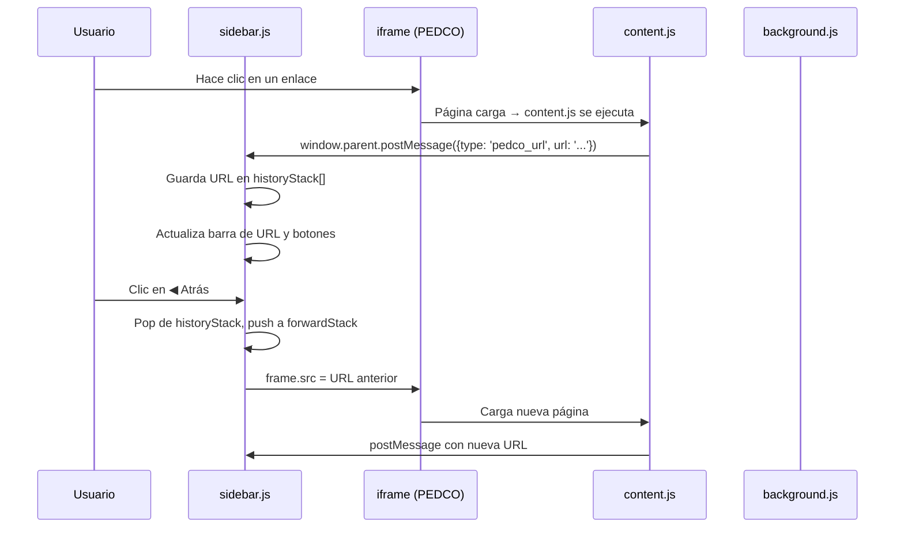

# 🎓 PEDCO+ — Extensión de Firefox para PEDCO UNCo

> **Fecha:** 14 de Junio de 2026  
> **Ubicación del proyecto:** `c:\Users\Ramoncito\Downloads\PEDCO-Extension\`  
> **Plataforma objetivo:** Firefox (Manifest V3)  
> **Sitio objetivo:** https://pedco.uncoma.edu.ar (Moodle)

---

## 📋 ¿Qué es PEDCO+?

Una extensión de Firefox que abre PEDCO (el campus virtual de la Universidad Nacional del Comahue) en la **barra lateral nativa** del navegador, convirtiéndola en un mini-navegador optimizado para la facultad.

### Funcionalidades

- 📌 **Panel lateral**: PEDCO se abre en la barra lateral de Firefox, permitiendo navegar por cursos sin perder la pestaña actual
- ◀▶ **Navegación Atrás/Adelante**: Botones propios de historial para moverse entre páginas dentro del panel
- 🔄 **Recargar**: Fuerza la recarga de la página actual
- 🏠 **Inicio**: Vuelve a "Mis Cursos" de un toque
- 📍 **Barra de URL**: Muestra la dirección actual de la página cargada en el panel
- 🎨 **Modo Oscuro (CSS)**: Estilos personalizados para PEDCO

---

## 🗂️ Arquitectura de Archivos

```
PEDCO-Extension/
├── manifest.json      → Configuración de la extensión (MV3)
├── background.js      → Script de fondo: intercepta tráfico de red y guarda en storage
├── sidebar.html       → Interfaz del panel lateral (HTML + CSS)
├── sidebar.js         → ⭐ Cerebro de la botonera: historial manual + escucha postMessage
├── content.js         → Se inyecta dentro de PEDCO: reporta URLs y escucha órdenes
├── style.css          → Estilos CSS inyectados en PEDCO (modo oscuro)
├── rules.json         → Reglas de declarativeNetRequest (quitar X-Frame-Options)
└── icons/             → Íconos de la extensión
```

---

## 🔧 Cómo funciona (Flujo de datos)



### Canales de comunicación

| Desde → Hacia | Método | Por qué |
|---|---|---|
| `content.js` → `sidebar.js` | `window.parent.postMessage()` | El iframe es hijo directo de sidebar.html |
| `sidebar.js` → iframe | `frame.src = url` | Cambiamos la URL del iframe directamente |
| `background.js` → storage | `browser.storage.local.set()` | Para diagnóstico y rastreo de red |

---

## ⚠️ Lecciones Aprendidas (MUY IMPORTANTE para el futuro)

### 1. 🚨 Manifest V3 prohíbe scripts inline

> [!CAUTION]
> En Manifest V3, Firefox **bloquea silenciosamente** todo `<script>código aquí</script>` dentro de páginas de extensión (popup, sidebar, options). El código simplemente **no se ejecuta** sin ningún error visible.

**Solución:** Siempre mover el JavaScript a un archivo `.js` separado y cargarlo con:
```html
<script src="sidebar.js"></script>
```

**Esta fue la causa raíz de TODOS los problemas durante el desarrollo.** Se perdió más de una hora intentando arreglar la comunicación entre scripts, cuando el verdadero problema era que el JavaScript de la barra lateral nunca se ejecutó.

### 2. Content scripts NO se inyectan en iframes de páginas de extensión

Los `content_scripts` del manifest.json **no se inyectan** en iframes que están dentro de páginas de extensión (como sidebar.html). Sin embargo, **sí funcionan** si se usa `filterResponseData` en background.js para inyectar el script directamente en el HTML de la respuesta HTTP.

En nuestro caso, `content.js` funciona porque PEDCO se carga en un iframe con `all_frames: true`, y Firefox sí lo inyecta en este contexto específico (iframe con URL web dentro de una sidebar de extensión).

### 3. `webRequest` sí funciona en sidebars

A pesar de que `webNavigation` no detecta navegación en iframes de sidebars, `webRequest.onBeforeRequest` **sí** detecta las peticiones de red (las clasifica como `sub_frame` con `tabId: -1`).

### 4. `postMessage` es el canal más confiable

Para comunicar el iframe de PEDCO con la barra lateral, `window.parent.postMessage()` es el método más confiable. No depende de APIs de extensión, no tiene restricciones de CORS, y funciona instantáneamente.

### 5. `browser.runtime.sendMessage` no funciona sidebar → sidebar

Los mensajes enviados con `runtime.sendMessage` desde background.js **no llegan** a sidebar.html de forma confiable. Es mejor usar `storage.onChanged` o `postMessage` como alternativa.

### 6. PEDCO usa X-Frame-Options

PEDCO (Moodle) envía cabeceras `X-Frame-Options: SAMEORIGIN` que impiden cargarlo en un iframe. Se resuelve con `declarativeNetRequest` en [rules.json](file:///c:/Users/Ramoncito/Downloads/PEDCO-Extension/rules.json):

```json
{
  "id": 1,
  "action": {
    "type": "modifyHeaders",
    "responseHeaders": [
      { "header": "X-Frame-Options", "operation": "remove" },
      { "header": "Content-Security-Policy", "operation": "remove" }
    ]
  },
  "condition": {
    "urlFilter": "pedco.uncoma.edu.ar",
    "resourceTypes": ["sub_frame"]
  }
}
```

---

## 🛠️ Cómo instalar / actualizar

1. Abrir Firefox → `about:debugging` → "Este Firefox"
2. Clic en "Cargar complemento temporal"
3. Seleccionar el archivo `manifest.json` de la carpeta del proyecto
4. Para actualizar después de cambios: clic en "Recargar" en la misma página

---

## 📝 Permisos necesarios (manifest.json)

| Permiso | Para qué |
|---|---|
| `storage` | Guardar datos entre sesiones |
| `declarativeNetRequest` | Quitar X-Frame-Options de PEDCO |
| `webRequest` | Interceptar tráfico de red para diagnóstico |
| `webRequestBlocking` | Poder modificar peticiones en tiempo real |
| `<all_urls>` (host) | Acceder a cualquier dominio desde el iframe |

---

## 🔮 Ideas futuras

- [ ] Modo oscuro completo para PEDCO
- [ ] Notificaciones de nuevas tareas/entregas
- [ ] Atajos de teclado para navegar
- [ ] Guardar cursos favoritos
- [ ] Publicar en Mozilla Addons (requiere firmar la extensión)
